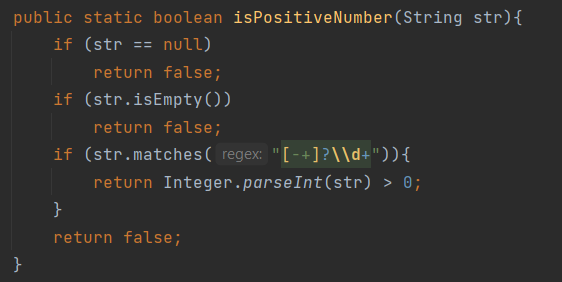
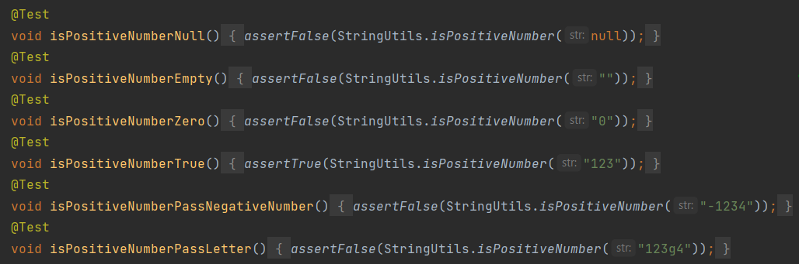
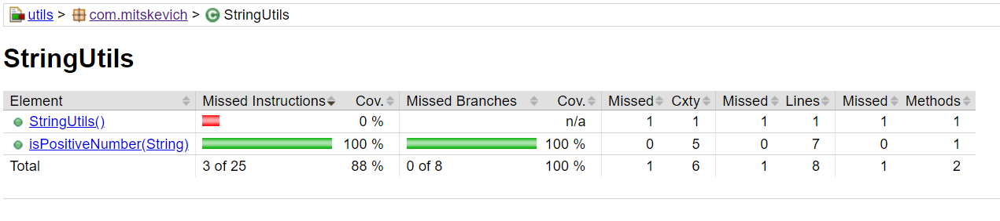
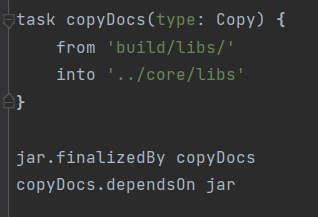
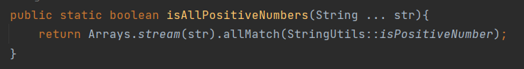
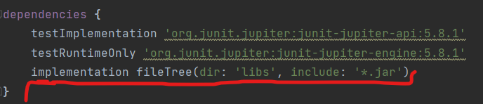
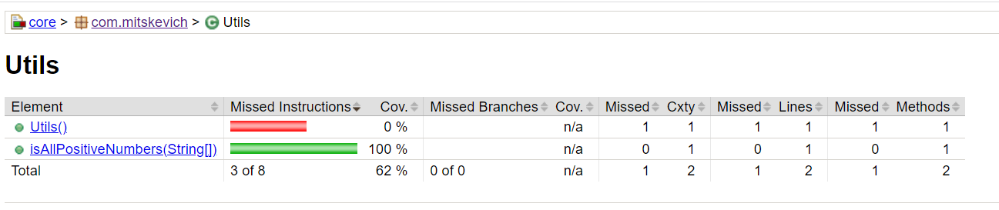
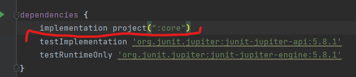
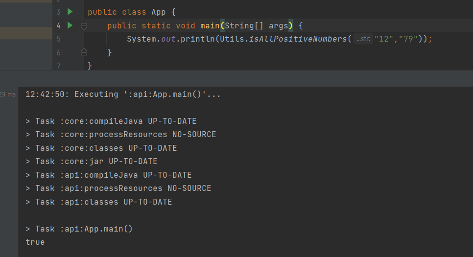
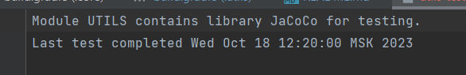

**Описание проекта:** многомодульный проект (3 модуля: utils, core, api), который принимает VarArgs и определяет являются ли все переданные значения положительными целыми числами (больше нуля), если да - то возвращается true, в противном случае - false.

**Модуль utils**, содержит класс StringUtils c методом  public static boolean isPositiveNumber(String str)

   

Для проверки его работы есть класс с тестами, используется JUnit 5.

   
   
Для генерации отчета об тестах используется библиотека JaCoCo.

   
   
После генерации jar файла данного модуля, он автоматически копируется в модуль core, для его использования в качестве зависимости.

   

**Модуль core**, содержит класс Utils c методом public static boolean isAllPositiveNumbers(String ... str), который принимает VarArgs и переиспользует метод из модуля utils, подключенного в виде зависимости в build.gradle

   

   

Также для тестирования этого метода используется JUnit5, а для генерации отчета об покрытии - библиотека JaCoCo.

   

**Модуль api** содержит класс App, где мы запускаем метод isAllPositiveNumbers из модуля core с параметрами ("12", "79"), предварительно подключив этот модуль в build.gradle

   

   

В модуль utils добавлен плагин CheckUseJacocoForTesting, который проверяет есть ли отчеты об тестах, выполненные библиотекой JaCoCo и если есть, то создает файл отчета, который содержит информацию, когда были запущены тесты последний раз.  

   

Если JaCoCo не подключено или нету отчетов об тестах, то создается файл отчета с соответствующей информацией.

   
